# 📝 Lista de Tarefas

**Desenvolvido por:** Pedro Sousa

## Descrição
Aplicação web para gestão de tarefas e notícias, criada com React.

## Funcionalidades
- ✅ Criar, editar e eliminar tarefas
- 📰 Notícias de várias categorias com imagens em formato quadrado
- 📅 Agenda de eventos
- 👤 Sistema de autenticação
- ⚙️ Configurações personalizáveis

## Como Utilizar

### Forma Simples
1. Abra o ficheiro `projeto/public/index.html` no navegador

### Com Servidor Local (Recomendado)
```bash
cd projeto/public
python -m http.server 8000
```
Depois aceda a: `http://localhost:8000`

### Com Base de Dados (Versão Completa)
1. Instale e inicie o MongoDB:
   ```powershell
   # Instalar MongoDB (caso não esteja instalado)
   # Via chocolatey:
   choco install mongodb
   
   # Ou descarregue diretamente do site oficial:
   # https://www.mongodb.com/try/download/community

   # Iniciar MongoDB
   # Se instalado como serviço:
   Start-Service MongoDB
   
   # Ou manualmente:
   "C:\Program Files\MongoDB\Server\6.0\bin\mongod.exe" --dbpath="C:\data\db"
   ```

2. Colocar a chave API do NewsAPI no ficheiro `projeto/src/services/news.js`:
   ```javascript
   // Colocar Aqui a Api do newsApi
   const NEWS_API_KEY = '+++++++++YOUR_API_KEY+++++++++';
   ```

3. Inicie o backend:
   ```bash
   cd backend
   npm install
   npm start
   ```


## Tecnologias
- React 18
- HTML5/CSS3
- JavaScript
- NewsAPI
- MongoDB (base de dados)
- Node.js (backend)

## 📸 Capturas de Ecrã

### Interface Principal
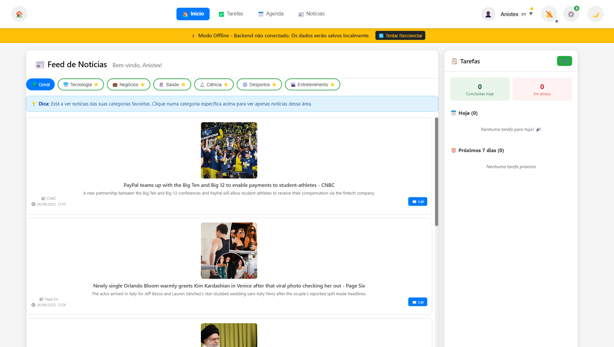
*Vista geral da página inicial com notícias e navegação principal*

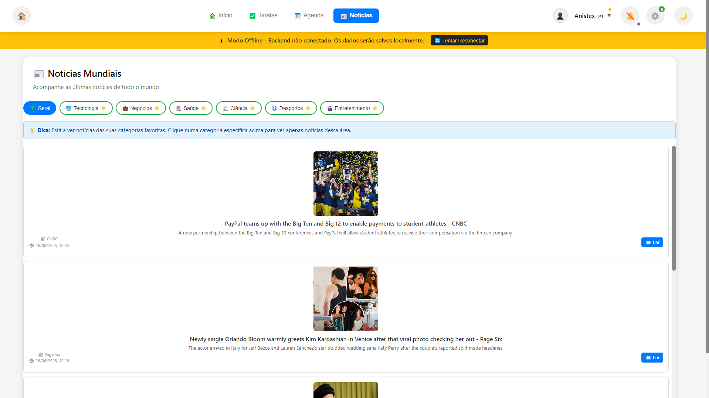
*Seção de notícias com categorias e filtros*

### Sistema de Autenticação
<table>
  <tr>
    <td width="50%">
      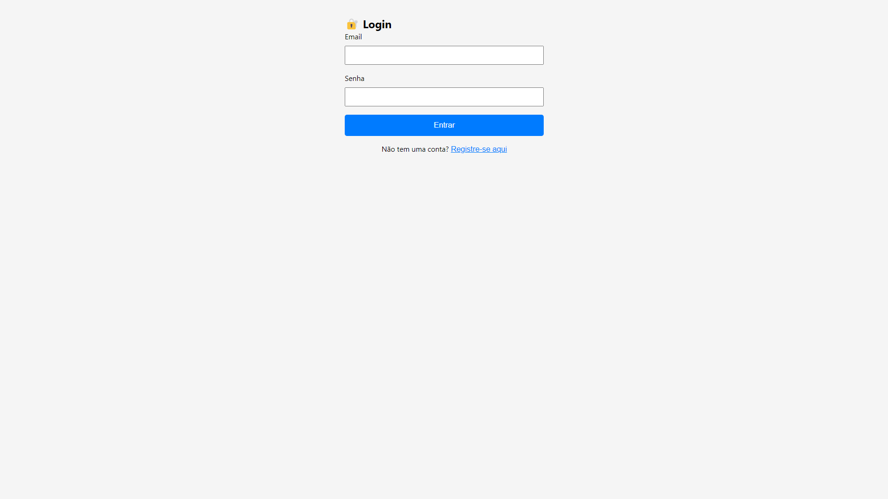
      <p align="center"><em>Ecrã de Login</em></p>
    </td>
    <td width="50%">
      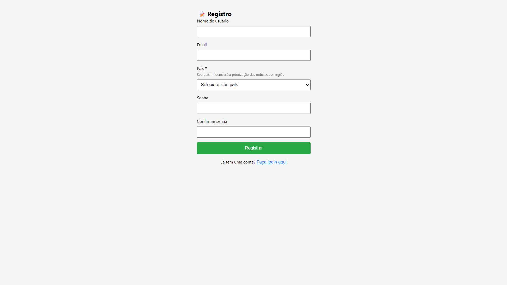
      <p align="center"><em>Ecrã de Registo</em></p>
    </td>
  </tr>
</table>

### Gestão de Tarefas
<table>
  <tr>
    <td width="50%">
      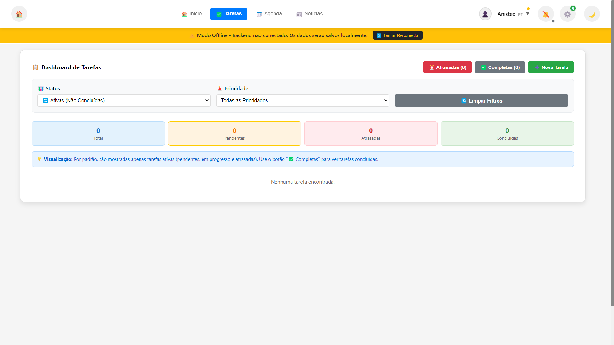
      <p align="center"><em>Dashboard de Tarefas</em></p>
    </td>
    <td width="50%">
      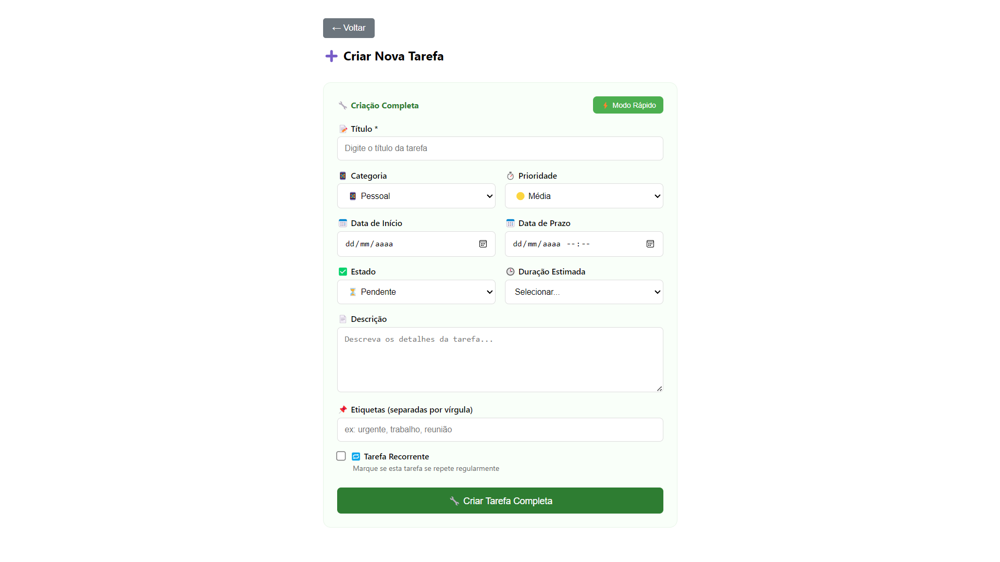
      <p align="center"><em>Formulário Completo de Criação</em></p>
    </td>
  </tr>
  <tr>
    <td width="50%">
      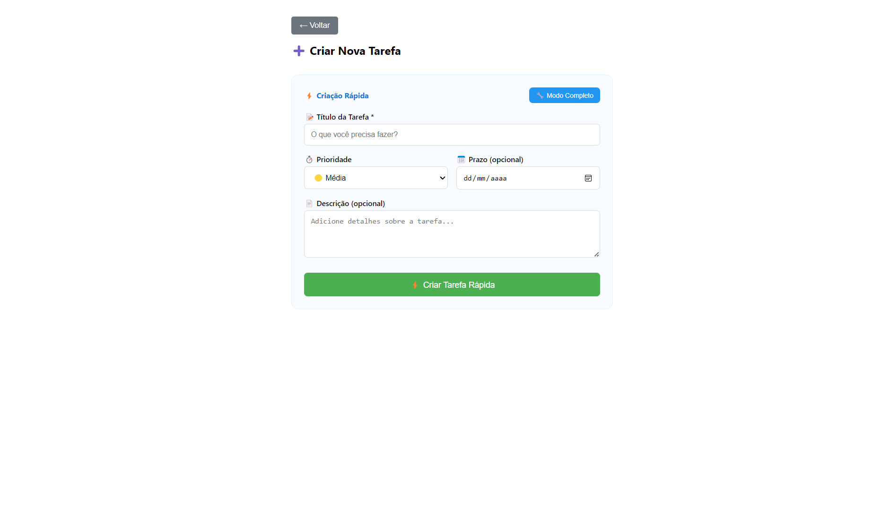
      <p align="center"><em>Criação Rápida de Tarefa</em></p>
    </td>
    <td width="50%">
      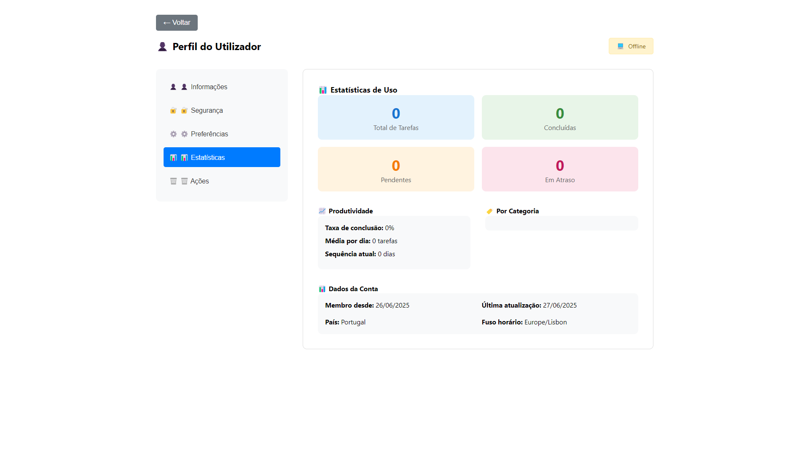
      <p align="center"><em>Estatísticas e Métricas</em></p>
    </td>
  </tr>
</table>

### Agenda de Eventos
<table>
  <tr>
    <td width="50%">
      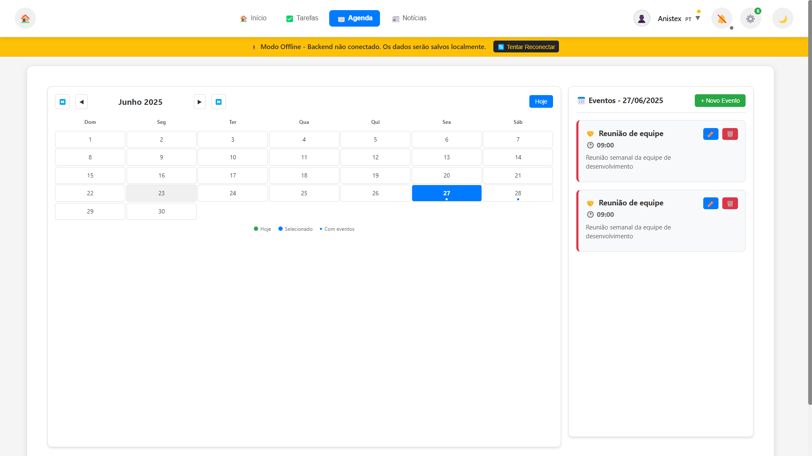
      <p align="center"><em>Vista da Agenda</em></p>
    </td>
    <td width="50%">
      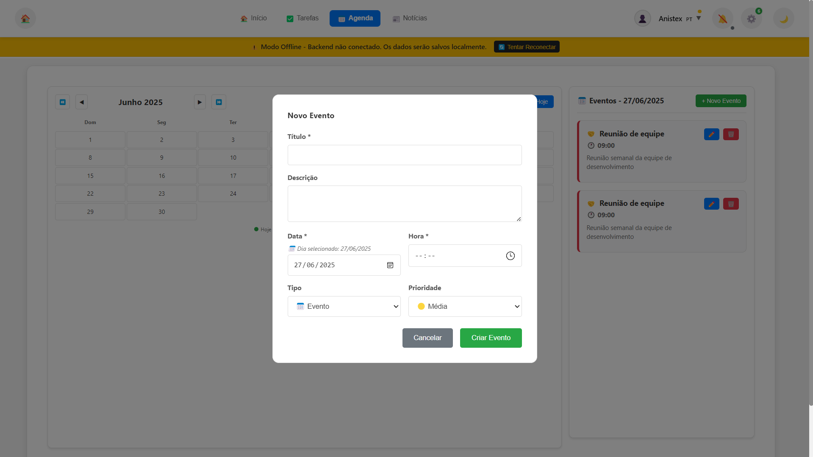
      <p align="center"><em>Criação de Novo Evento</em></p>
    </td>
  </tr>
</table>

### Sistema de Notificações
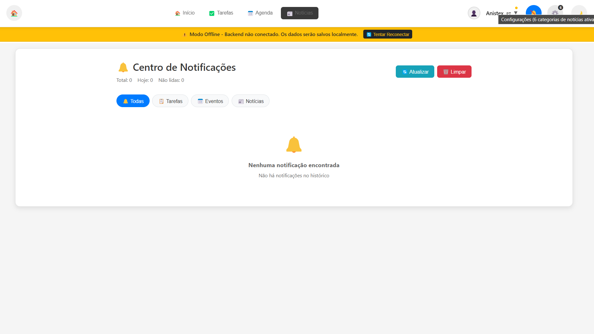
*Centro completo de notificações com histórico e filtros*

### Configurações do Sistema
<table>
  <tr>
    <td width="50%">
      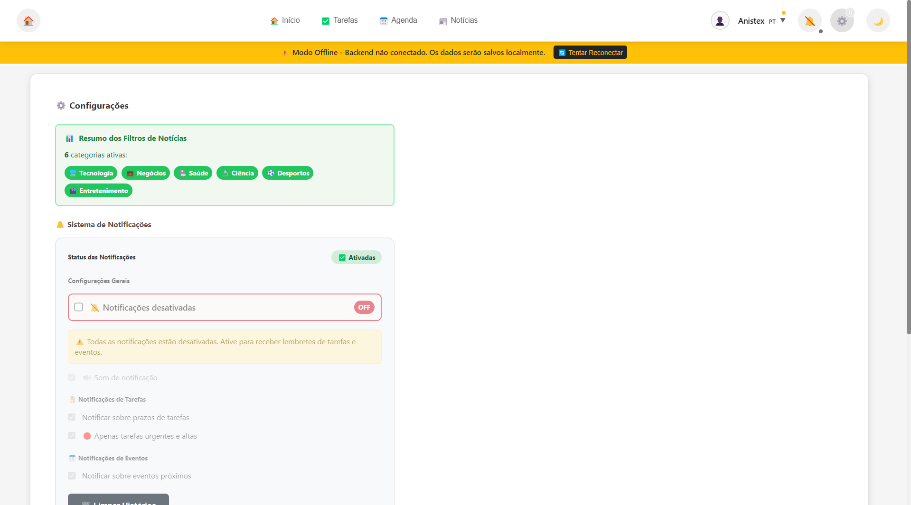
      <p align="center"><em>Painel Principal de Configurações</em></p>
    </td>
    <td width="50%">
      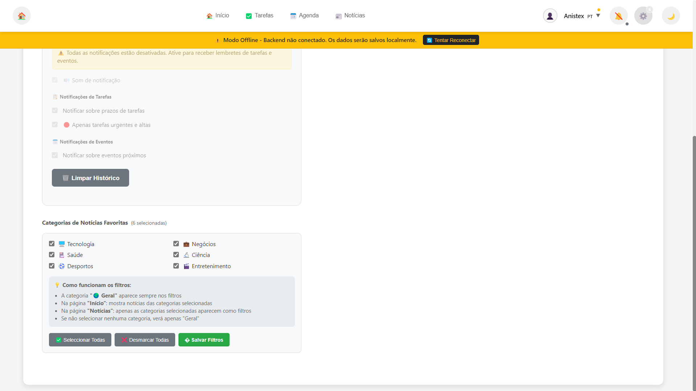
      <p align="center"><em>Configurações Avançadas</em></p>
    </td>
  </tr>
</table>

### Perfil e Preferências
<table>
  <tr>
    <td width="33%">
      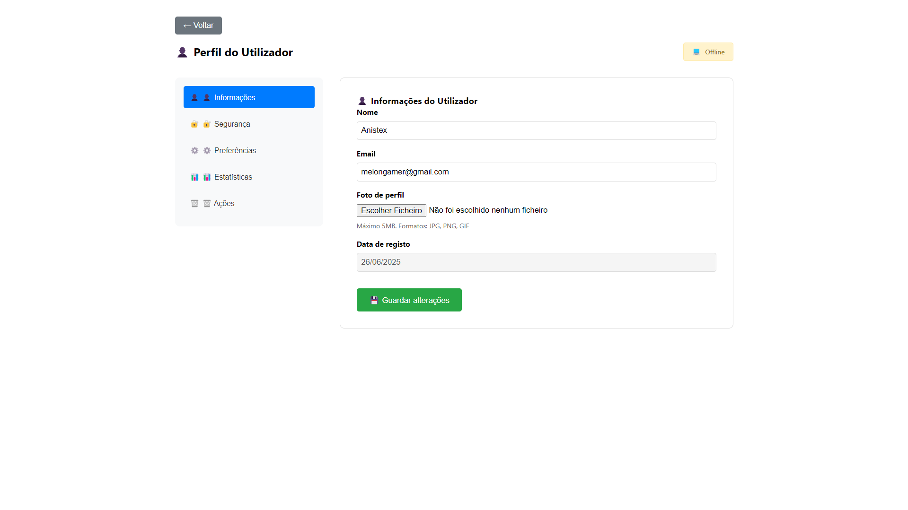
      <p align="center"><em>Informações do Perfil</em></p>
    </td>
    <td width="33%">
      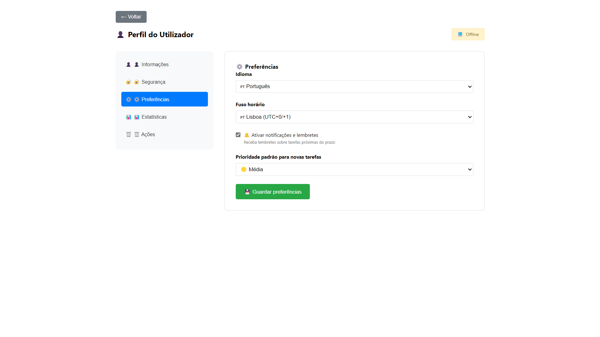
      <p align="center"><em>Preferências do Utilizador</em></p>
    </td>
    <td width="33%">
      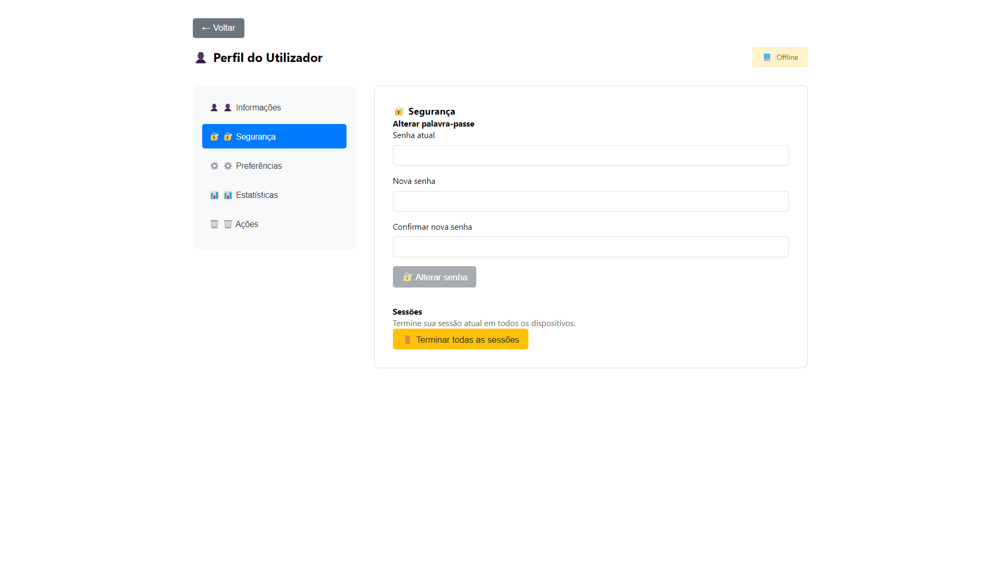
      <p align="center"><em>Alteração de Palavra-passe</em></p>
    </td>
  </tr>
</table>

### Tema Escuro e Ações
<table>
  <tr>
    <td width="50%">
      
      <p align="center"><em>Interface em Modo Escuro</em></p>
    </td>
    <td width="50%">
      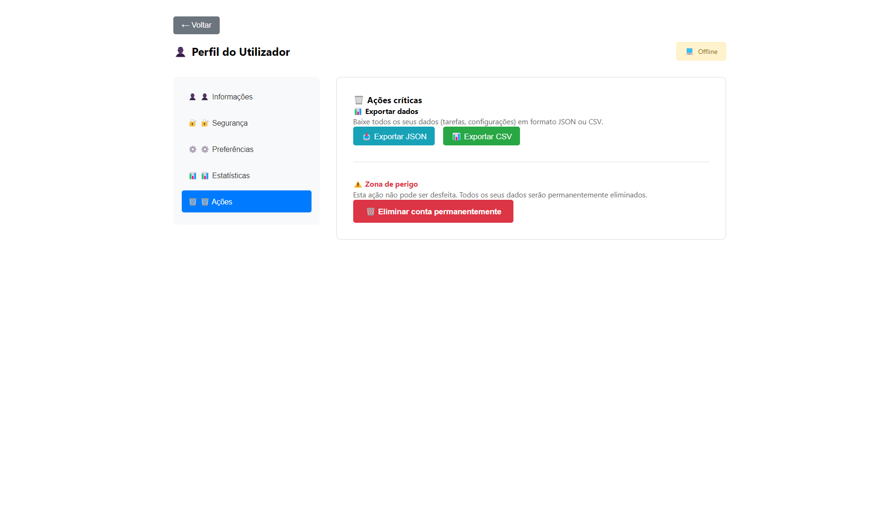
      <p align="center"><em>Menu de Ações</em></p>
    </td>
  </tr>
</table>

---

## 🚀 Características Destacadas

- **🎨 Interface Moderna**: Design limpo e intuitivo
- **🌓 Modo Escuro**: Alternância entre temas claro e escuro
- **📱 Responsivo**: Adaptado para desktop e dispositivos móveis
- **🔔 Notificações**: Sistema completo de lembretes e alertas
- **⚡ Performance**: Carregamento rápido e otimizado
- **🔐 Segurança**: Autenticação segura e proteção de dados
- **📅 Agenda**: Visualização e gestão de eventos

---
**© 2025 Pedro Sousa**